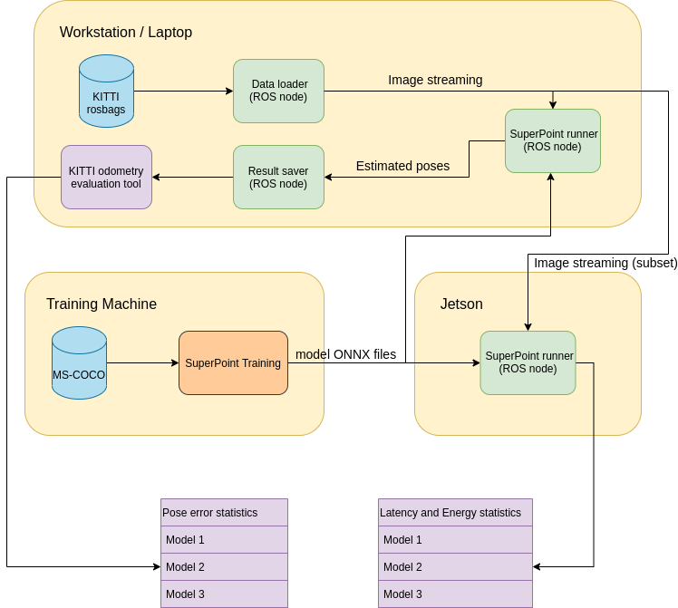

# SuperPoint Stereo Visual Odometry

This repository stores the evaluation and deployment code of our On-Device Machine Learning course project. Team members are [Yukun Xia](https://github.com/YukunXia), and [Yuqing Qin](https://github.com/Sunny-Qin-0314). The goal of this project is to explore the relationships between the performance and latency/energy efficiency of different visual odometry front ends, and benchmark them on a Jetson Nano. We retrained SuperPoint models with different backbones, as well as changed the configurations, eg. input resolution and quantization. We tested 78 configurations on KITTI dataset, and our temporary conclusion is that, for an edge device with a basic DL accelerator, the performance, latency and energy efficiency of a SuperPoint model can be competitive against classic methods, eg. ORB and SIFT. But still, we need more data and more rigorous tests.

For more details, please read our project report pdf under the root folder.

# Dependencies

- ROS
- OpenCV 4.5.4
- Ceres
- Eigen3 3.3
- CUDA
- TensorRT 8.2

# System Diagram

    

# Usage

## Basic

- Download rosbags or create rosbags from KITTI dataset via `kitti2bag`
- `catkin_make`
- `source devel/setup.bash` or `source devel/setup.zsh`
- `rosrun odml_visual_odometry engine_generation.py`
- `roslaunch odml_data_processing main.launch`
- `rostopic pub /kitti_loader_action_server/goal odml_data_processing/kitti_data_loaderActionGoal "header:
  seq: 0
  stamp:
    secs: 0
    nsecs: 0
  frame_id: ''
goal_id:
  stamp:
    secs: 0
    nsecs: 0
  id: ''
goal:
  kitti_eval_id: 4
  description: ''"`

## Evaluate over all configurations

please checkout the `long_term_eval` branch