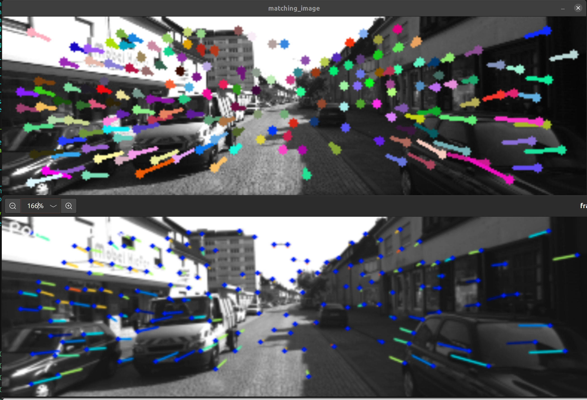
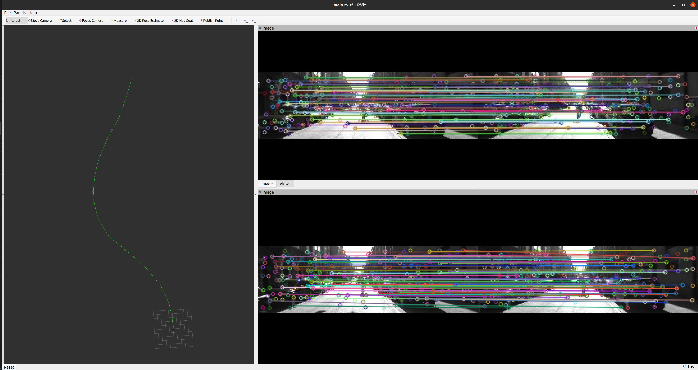

# Verification of this reimplementation

`rosrun odml_visual_odometry test_superpoint`



- Above: this repo's result
- Below: original repo's result

(Note: matching mechanisms can be slightly different. This comparison serves only as a verification that the neural network deployment works well in this implementation.)

# Testing this implementation on a tiny KITTI sequence


## Laptop test

- GPU: RTX2070
- CPU: AMD Ryzen 5 3600 6-Core Processor

### Classic (ORB, ~375x1242 input resolution, Stereo)


> [ INFO] [1636777109.563199761]: (pre, mid, post)processing detection of 1 image takes 31.5190 ms
> [ INFO] [1636777109.612307811]: matching of 1 image takes 49.0600 ms
> [ INFO] [1636777109.618672456]: solveStereoOdometry of 1 image takes 6.3810 ms

> [ INFO] [1636777647.459838649]: 860 matches for CURR_LEFT_CURR_RIGHT
> [ INFO] [1636777647.487029256]: 1215 matches for PREV_LEFT_CURR_LEFT

~2000 keypoints on both images (about half of them are successfully matched to the keypoints on another image)
About 11.6FPS in total

### Superpoint our implementation (120x392 input resolution, Stereo)



> [ INFO] [1636776494.794887287]: (pre, mid, post)processing detection of 1 image takes 7.3910 ms
> [ INFO] [1636776494.800944169]: matching of 1 image takes 6.0320 ms
> [ INFO] [1636776494.802574759]: solveStereoOdometry of 1 image takes 1.6310 ms

> [ INFO] [1636777693.619934684]: 177 matches for CURR_LEFT_CURR_RIGHT
> [ INFO] [1636777693.623684806]: 195 matches for PREV_LEFT_CURR_LEFT

~200 keypoints on both images (most of them are successfully matched to the keypoints on another image)
About 66.3FPS in total

### Superpoint original repo (120x392 input resolution, Monocular)

> Processed image 22 (net+post_process: 42.59 FPS, total: 13.98 FPS).

# TODO 

- Finish the data saving module
- Separate running modes into monocular and stereo, and load different trt engines accordingly
- Test the code on Jetson Nano
    - Install OpenCV 4.5.1, ROS, Eigen
- Test the performance on the whole KITTI dataset

# Troubleshooting

## SIFT not declared
> error: ‘cv::SIFT’ has not been declared
>  125 |     detector_ = cv::SIFT::create();

Solution:

`sudo subl /opt/ros/noetic/share/cv_bridge/cmake/cv_bridgeConfig.cmake`

At line 94-96, replace opencv path to the true one with >=4.5.1 version. eg. 

```
if(NOT "include;/usr/local/include/opencv4 " STREQUAL " ")
  set(cv_bridge_INCLUDE_DIRS "")
  set(_include_dirs "include;/usr/local/include/opencv4")
```